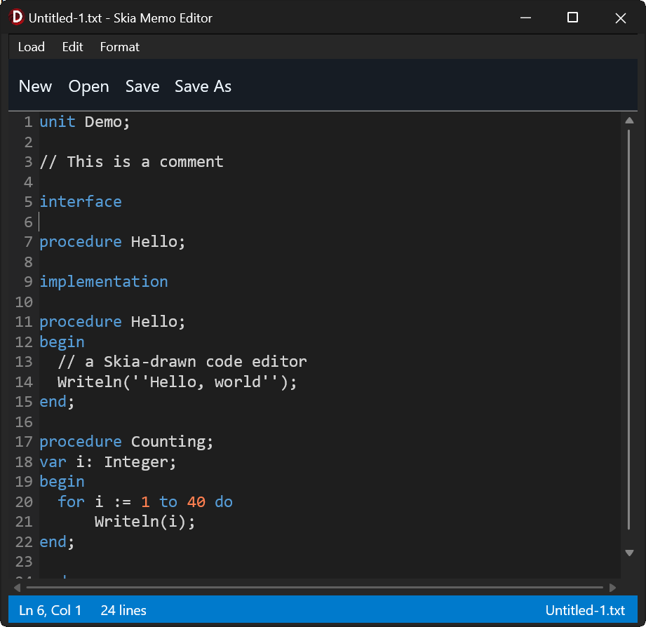

# TSkiaCodeEditor

An owner-drawn, Skia-backed code editor control for **FireMonkey (FMX) / Delphi**.
A memo-like control with a line-number gutter, pluggable syntax highlighting,
find/replace, word wrap, and error markers — that behaves **identically on
Windows and macOS**.

## Why it exists

FMX's `TMemo` routes through **different presenters per OS**: the FMX-drawn
styled presenter on Windows, and a native `NSTextView` on macOS. Per-character
colouring, gutter alignment, and caret arithmetic tuned on one platform silently
diverge on the other, because the underlying text layout and metrics engines are
not the same. No amount of patching unifies them.

`TSkiaCodeEditor` removes the native presenter from the loop. **Every glyph is
measured and drawn with Skia**, so there is one paint path and one set of
metrics on every platform. Text layout never touches `TTextLayout`,
`Canvas.MeasureText`, or native text services.

## Features

- **Skia rendering** — one paint path, identical metrics on Windows and macOS.
- **Pluggable syntax highlighting** — a pure, per-line tokenizer
  `(text, stateIn) -> (runs, stateOut)`. Lex state flows line to line, so
  multi-line constructs (block comments) work. A ready-made `TSimpleHighlighter`
  ships with Pascal, C-like, and Antimony presets.
- **Word wrap** — optional; off by default so the fast no-wrap path stays default.
- **Editing** — full keyboard editing, selection (shift/drag/double-click word),
  clipboard, and undo/redo with typing coalesced into sensible steps.
- **Find / replace** — with a built-in docked find bar, highlight-all matches,
  match case, and whole word. Or supply your own UI.
- **Markers** — host-owned annotations for parser errors: whole-line tints or
  wavy underlines, with **own-drawn multi-line, per-run-coloured tooltips** on
  hover.
- **Owned scrolling** — real scrollbars, not a `TScrollBox` (whose overlay
  scrollbars and inertia differ between Windows and macOS).
- **Lazy work** — only visible rows are ever laid out or tokenized.

<p float="center">
  
</p>

## Requirements

- RAD Studio / Delphi **13** (BDS 37.0) — developed and built against this.
  It should work on Delphi 12, the first version to bundle Skia, but that has
  not been tested.
- **Skia**, which ships with RAD Studio — no external Skia4Delphi dependency.
  Enable it for your application: *Project > Options > Application > Skia* →
  **Enable Skia**.

## Installation

1. Open the project group `Packages\RhoFMXEditorGroup.groupproj` (or the two
   `.dpk` files individually).
2. **Build** `SkiaCodeEditor` (the runtime package) for every platform you
   target.
3. **Install** `dclSkiaCodeEditor` (the design-time package). Design-time
   packages are loaded by the IDE, which is a 32-bit process — build this one
   for **Win32** regardless of what your application targets.
4. Add the `Source` folder to your project's *Library path* (or its unit search
   path) so the compiler can find the units.

`TSkiaCodeEditor` then appears on the **Rhody Controls** palette page, for
FireMonkey forms.

You can also skip packages entirely and just add the four units from `Source`
to your project — the component works fine constructed in code.

## Quick start

```pascal
uses uSkiaCodeEditor;

Editor := TSkiaCodeEditor.Create(Self);
Editor.Parent := Self;
Editor.Align := TAlignLayout.Client;

// Batteries included: pick a comment/string style and add keywords.
Editor.Highlighter.UseAntimony;
Editor.Highlighter.AddKeywords(['species', 'compartment', 'model', 'end']);

Editor.WordWrap := True;
Editor.SetText(TFile.ReadAllText('model.txt'));
```

Ctrl/Cmd+F opens the built-in find bar; Ctrl/Cmd+G fires `OnRequestGotoLine` so
the host can prompt for a line number (the control never pops dialogs itself).

---

# API reference

Two conventions run through the whole API:

- **Lines and columns are 1-based** in everything public — `CaretLine`,
  `GoToLine`, `AddMarker`, `LineText`. (Internally they are 0-based; the
  boundary converts.)
- **The control never pops dialogs.** Where a UI is needed it either ships one
  you can turn off (`BuiltInFindUI`) or fires an event for you to handle
  (`OnRequestGotoLine`).

## Document text

| Member | Description |
|---|---|
| `procedure SetText(const AText: string)` | Replace the whole document. Normalises CRLF/CR to LF. Resets caret, clears undo history and markers, and clears `Modified`. |
| `function GetText: string` | The whole document, lines joined with `#10`. |
| `function LineCount: Integer` | Number of logical lines (not visual rows). |
| `function LineText(ALine: Integer): string` | Text of one line, 1-based. `''` if out of range. |

## Modified state / change notification

| Member | Description |
|---|---|
| `property Modified: Boolean` | The dirty flag. Becomes `True` on any edit; `SetText` (load) clears it. Set it back to `False` yourself after saving. Read it in your form's `OnCloseQuery` to decide whether to prompt "save changes?". |
| `event OnChange: TNotifyEvent` | Fires only when the text is mutated (typing, delete, paste, replace, undo/redo) — **not** on caret moves and **not** on `SetText`/load. Use it to enable a Save action or flag the title bar. |

`Modified` is the persistent state; `OnChange` is the live notification behind
it. Undo does **not** clear `Modified` (matches `TMemo`) — the flag stays set
even if you undo back to the on-disk text. See the exit-prompt cookbook below.

## Navigation

| Member | Description |
|---|---|
| `procedure GoToLine(ALine: Integer)` | 1-based. Caret to the line's start, scrolled roughly centred. Clamped to the document. |
| `property CaretLine: Integer` | Read-only, 1-based. |
| `property CaretColumn: Integer` | Read-only, 1-based. |
| `property SelText: string` | Read-only. The current selection, `''` if none. |
| `event OnCaretChange` | Fires after any caret move **or** edit. Drive a status bar off this. |

## Undo / redo

| Member | Description |
|---|---|
| `procedure Undo` / `procedure Redo` | One step. Consecutive typed characters coalesce into a single step; any caret move or click breaks the run. |
| `function CanUndo: Boolean` / `function CanRedo: Boolean` | For enabling menu items. |

History is bounded at 1000 steps and is cleared by `SetText`. Every text
mutation — typing, paste, `ReplaceAll` — goes through one choke point, so
everything is undoable, and `ReplaceAll` is a *single* step.

## Find and replace

Matches are **single-line** (the search string never contains a newline).

```pascal
type TFindOption  = (foMatchCase, foWholeWord, foWrapAround);
     TFindOptions = set of TFindOption;
```

| Member | Description |
|---|---|
| `function FindNext(const ASearch: string; AOptions: TFindOptions = [foWrapAround]): Boolean` | Selects and centres the next match after the caret/selection. |
| `function FindPrevious(...)` | Same, backwards. |
| `function ReplaceCurrent(const ASearch, AReplace: string; AOptions = [foWrapAround]): Boolean` | Replaces the selection if it *is* a match, then advances to the next one. |
| `function ReplaceAll(const ASearch, AReplace: string; AOptions: TFindOptions = []): Integer` | Returns the count. One undo step. |
| `procedure HighlightMatches(const ASearch: string; AOptions: TFindOptions = [])` | Tint every visible occurrence. `FindNext`/`FindPrevious` call this for you. |
| `procedure ClearHighlightMatches` | Drop the highlights. Esc does this too. |

The match you are *on* is painted in `FindMatchColor`; the others in the weaker
`FindHighlightColor`. Matches are located per **visible line** at paint time, so
highlight-all costs nothing on a large document.

**Custom find UI:** set `BuiltInFindUI := False` and handle `OnRequestFind`
(fired on Ctrl/Cmd+F). Drive the methods above from your own controls, and call
`HighlightMatches` / `ClearHighlightMatches` as the user types.

## Markers and tooltips

Host-owned annotations — errors, warnings, "look here". **Purely visual: they
never move the caret or the selection.**

```pascal
type TMarkerKind = (mkTint, mkSquiggle);   // rectangle behind text | wavy underline
```

| Member | Description |
|---|---|
| `procedure AddMarker(ALine, ACol, ALen: Integer; AKind; AColor; const AMessage: string = '')` | The general one. `ALen <= 0` means "to end of line". |
| `procedure AddMarker(ALine, ACol, ALen; AKind; AColor; const ATip: TTipText)` | As above, with a rich tooltip. |
| `procedure MarkLine(ALine: Integer; AKind; AColor; const AMessage \| ATip)` | The whole line. |
| `procedure MarkWordAt(ALine, ACol: Integer; AKind; AColor; const AMessage \| ATip)` | Grows the span over the word at `ACol`. Use when a parser gives a token's position but not its length. Falls back to a single character if `ACol` isn't on a word. |
| `procedure ClearMarkers` | Remove all. |
| `function MarkerCount: Integer` | |
| `function MarkerMessageAt(ALine, ACol: Integer): string` | Message of the first marker covering that position, else `''`. Drive a status bar or your own tooltip off this. |
| `property MarkersClearOnEdit: Boolean` | Default `True`. Any edit drops all markers — they describe text that just changed. `SetText` always drops them. |

Out-of-range lines are **ignored, not raised**: a parser reporting a line past
EOF must not crash the editor.

### Tooltips

Hovering a marker for 500 ms shows a tooltip, drawn with Skia (not FMX `Hint`),
so it can be multi-line with per-run colour and bold. It is dismissed by any
key, click, scroll, or mouse-leave.

```pascal
type TTipRun  = record Text: string; Color: TAlphaColor; Bold: Boolean; end;
     TTipLine = TArray<TTipRun>;
     TTipText = TArray<TTipLine>;

function TipRun(const AText: string; AColor: TAlphaColor = TAlphaColors.Null;
  ABold: Boolean = False): TTipRun;
function TipLine(const ARuns: array of TTipRun): TTipLine;
function Tip(const ALines: array of TTipLine): TTipText;
```

A run whose `Color` is `TAlphaColors.Null` uses `TooltipTextColor`. Passing a
plain `string` message instead of a `TTipText` yields one default-coloured run
per `#10` line — so the simple case stays a one-liner.

## Syntax highlighting

The editor owns a `TSimpleHighlighter` lazily; first access installs it as the
tokenizer. Changing keywords, rules, or colours re-lexes automatically.

```pascal
function Highlighter: TSimpleHighlighter;   // note: a function, not a property
```

| `TSimpleHighlighter` member | Description |
|---|---|
| `procedure UsePascal` | `//` line; `{ }` and `(* *)` blocks; `'...'` strings; case-insensitive. |
| `procedure UseCLike` | `//` line; `/* */` block; `"..."` strings; case-sensitive. |
| `procedure UseAntimony` | `//` and `#` line; `/* */` block; `"..."` strings; case-sensitive. |
| `procedure AddKeyword(const AWord: string)` / `AddKeywords(const AWords: array of string)` | |
| `procedure ClearKeywords` / `ClearRules` | |
| `procedure AddLineComment(const APrefix: string)` | |
| `procedure AddBlockComment(const AOpen, AClose: string)` | Multi-line. |
| `procedure AddStringDelimiter(const ADelim: Char)` | |
| `property CaseSensitive: Boolean` | |
| `property KeywordColor`, `StringColor`, `CommentColor`, `NumberColor` | `TAlphaColor`. |

A preset sets comment and string rules **only** — keywords are added separately.

### Writing your own tokenizer

The contract is pure and per-line, which is what keeps re-lexing one edited line
cheap. Lex state flows line to line, so multi-line constructs work.

```pascal
type TTokenizeLineProc = reference to function(const ALine: string;
  AStateIn: TLexState; out ARuns: TTokenRunArray): TLexState;

type TTokenRun = record
  StartCol: Integer;   // 0-based column into the line
  Length: Integer;
  Color: TAlphaColor;
  Bold, Italic: Boolean;
end;
```

Install with `SetTokenizer(AProc)`; force a full re-lex with
`InvalidateAllTokens`. Runs must be ascending and non-overlapping; gaps fall
back to `TextColor`. Return `lsDefault` (0) for "no continuation", or any other
integer to encode your own state (e.g. "inside a block comment").

> `TTokenRun.Bold` and `.Italic` are carried through but **not yet rendered** —
> the painter uses one font. Token colour works today.

## Appearance

| Property | Default | Notes |
|---|---|---|
| `FontFamily: string` | per-platform | `Consolas` on Windows, `Menlo` on macOS, `DejaVu Sans Mono` elsewhere. Live: rebuilds metrics and re-lays out. |
| `FontSize: Single` | `13` | Live. |
| `Monospace: Boolean` | `True` | Requests the integer-advance fast path. It is used **only if the face really is fixed-pitch** — see below. |
| `GutterVisible: Boolean` | `True` | Off ⇒ text starts at x = 0. The gutter auto-sizes to the widest line number. |
| `WordWrap: Boolean` | `False` | On ⇒ hides the horizontal scrollbar. |
| `BackgroundColor` | white | |
| `TextColor` | black | Also the fallback for gaps between token runs. |
| `GutterColor` / `GutterTextColor` | `$FFF0F0F0` / `$FF808080` | |
| `CaretColor` | black | |
| `SelectionColor` | `$400078D7` | Use alpha < `FF`. |
| `FindMatchColor` | `$A0FF9800` | The match you're on. |
| `FindHighlightColor` | `$40FFC107` | Every other visible match. Keep it weaker. |
| `TooltipColor` / `TooltipTextColor` / `TooltipBorderColor` | `$FF2D2D30` / `$FFF0F0F0` / `$FF6E6E70` | |

All colour properties merely repaint. Font properties rebuild Skia metrics.
Everything is a live setter — no `BeginUpdate`/`EndUpdate` needed.

> **`Monospace` is a request, not an assertion.** Skia does not fail on a
> missing font family — it silently substitutes a default, proportional
> typeface. Taking the fixed-advance fast path against such a face renders text
> correctly but drifts the caret further from the glyph the further right you
> go. So `RebuildFontMetrics` measures `'0'`, `'W'` and `'i'`, and only uses the
> fast path when their advances agree. Set a proportional `FontFamily` (or name
> a font that isn't installed) and the editor quietly falls back to
> per-character measurement — slower, but always correct.

## Behaviour

| Property | Default | Notes |
|---|---|---|
| `BuiltInFindUI: Boolean` | `True` | Ctrl/Cmd+F shows the docked find bar. `False` ⇒ fires `OnRequestFind`. |
| `HighlightAllMatches: Boolean` | `True` | `False` ⇒ only the current match is highlighted. |
| `MarkersClearOnEdit: Boolean` | `True` | |

## Events

| Event | When |
|---|---|
| `OnCaretChange: TNotifyEvent` | After any caret move or edit. |
| `OnChange: TNotifyEvent` | After any text mutation (not caret moves, not load). |
| `OnRequestGotoLine: TNotifyEvent` | Ctrl/Cmd+G. Show a prompt, then call `GoToLine`. |
| `OnRequestFind: TNotifyEvent` | Ctrl/Cmd+F, **only** when `BuiltInFindUI = False`. |

## Keyboard

| Key | Action |
|---|---|
| Arrows, Home, End, PgUp, PgDn | Move caret. Hold **Shift** to extend the selection. |
| Ctrl/Cmd + C, X, V | Copy, cut, paste (via `IFMXClipboardService` — no native text services). |
| Ctrl/Cmd + A | Select all. |
| Ctrl/Cmd + Z | Undo. **Shift+**Ctrl/Cmd+Z or Ctrl+Y to redo. |
| Ctrl/Cmd + F | Find bar, or `OnRequestFind`. |
| Ctrl/Cmd + G | `OnRequestGotoLine`. |
| Esc | Dismiss the find bar, its highlights, and any tooltip. Leaves the caret alone. |
| Double-click | Select the word. |
| Mouse wheel | Scroll three lines per notch. |

With `WordWrap` on, **Up/Down/PgUp/PgDn move by visual row** and Home/End act on
the visual row. A vertical run keeps its horizontal position, so moving down
past a short line and back up returns you to the column you started from.

---

## Cookbook: showing parser errors

Re-mark the document after each parse:

```pascal
Editor.ClearMarkers;

// Squiggle the offending token, with a rich multi-line tooltip.
Editor.MarkWordAt(10, Col, mkSquiggle, TAlphaColors.Red,
  Tip([ TipLine([TipRun('Error', TAlphaColors.Red, True),
                 TipRun(' in reaction rate "k9*S0S1"')]),
        TipLine([TipRun('  syntax error, unexpected element name')]) ]));

// Or tint a whole line when you only have a line number.
Editor.MarkLine(12, mkTint, $30FF0000, 'unused species');
```

**Watch the column.** A parser may report a position **inside a quoted
sub-expression** rather than a column in the line. Antimony does exactly this:

```
Antimony: Error in model string, line 10:  In the reaction rate "k9*S0S1":
Error when parsing input 'k9*S0 S1' at position 8: syntax error, ...
```

`position 8` is an offset into `'k9*S0 S1'`, not into line 10. Use `LineText` to
find the sub-expression in the line, then add the offset:

```pascal
P := Pos('k9*S0 S1', Editor.LineText(10));
if P > 0 then
  Editor.MarkWordAt(10, P + 8 - 1, mkSquiggle, TAlphaColors.Red, ErrText);
```

`MarkWordAt` then grows the span over the whole offending token, because the
parser told you where it starts but not how long it is.

## Cookbook: a status bar

`OnCaretChange` fires after every caret move *and* every edit, so one handler
keeps a status bar current.

```pascal
// In the form declaration:
//   procedure EditorCaretChange(Sender: TObject);
Editor.OnCaretChange := EditorCaretChange;

procedure TfrmMain.EditorCaretChange(Sender: TObject);
begin
  Status.Text := Format('Ln %d, Col %d   %d lines',
    [FEditor.CaretLine, FEditor.CaretColumn, FEditor.LineCount]);
  // Surface the error under the caret, if any.
  ErrLabel.Text := FEditor.MarkerMessageAt(FEditor.CaretLine, FEditor.CaretColumn);
end;
```

## Cookbook: prompt to save on exit

Put the check in the form's `OnCloseQuery` — that single handler catches **every**
exit path (the window's close button and a Quit menu that just calls `Close`).
Reset `Modified` after each save; `SetText` clears it on load automatically.

`TDialogService` is asynchronous, so you can't decide `CanClose` inline: hold
the close, ask, and re-close from the callback. Defer that `Close` with
`TThread.ForceQueue` so it runs *after* the dialog stack unwinds — calling
`Close` re-entrantly from inside a modal dialog can crash.

```pascal
procedure TfrmMain.SaveDocument(const AFileName: string);
begin
  TFile.WriteAllText(AFileName, FEditor.GetText);
  FEditor.Modified := False;              // on disk now => no longer dirty
end;

procedure TfrmMain.mnuQuitClick(Sender: TObject);
begin
  Close;                                  // routes through OnCloseQuery
end;

procedure TfrmMain.FormCloseQuery(Sender: TObject; var CanClose: Boolean);
begin
  if FForceClose or (not FEditor.Modified) then
  begin
    CanClose := True;                     // nothing unsaved, or already resolved
    Exit;
  end;
  CanClose := False;                      // hold; decide in the callback
  TDialogService.MessageDialog('Save changes before closing?',
    TMsgDlgType.mtConfirmation,
    [TMsgDlgBtn.mbYes, TMsgDlgBtn.mbNo, TMsgDlgBtn.mbCancel], TMsgDlgBtn.mbYes, 0,
    procedure(const AResult: TModalResult)
    begin
      if AResult = mrCancel then Exit;    // stay open
      if AResult = mrYes then SaveDocument(CurrentFile);
      FForceClose := True;                // let the re-close through
      TThread.ForceQueue(nil, procedure begin Close; end);
    end);
end;
```

`FForceClose` is a `Boolean` field on the form.

## Layout

| Folder      | Contents |
|-------------|----------|
| `Source`    | The component. Add this to your library path. |
| `Packages`  | Runtime (`SkiaCodeEditor`) and design-time (`dclSkiaCodeEditor`) packages. |
| `Demo`      | A working host application: theming, file open/save, go-to-line, status bar. |

`Source` units:

- `uCodeEditorTypes.pas` — shared token, marker, and tooltip types. Its own unit
  so the editor and highlighters can both use it with no circular dependency.
- `uSkiaCodeEditor.pas` — the control.
- `uSyntaxHighlighter.pas` — `TSimpleHighlighter`, a configurable tokenizer.
- `uFindBar.pas` — `TFindBar`, the built-in docked find/replace bar.
- `uSkiaCodeEditorReg.pas` — design-time registration only.

## Developing the component

Open `Packages\RhoFMXEditorGroup.groupproj` — a project group of the runtime
package, the design package, and the demo. Edit the component units and press
F9 on the demo: because the demo links `Source` statically (via its unit search
path), your changes recompile straight into it, with no package rebuild. Rebuild
and reinstall the design package only when you need refreshed *design-time*
behaviour (e.g. a newly published property in the Object Inspector).

## Design notes

**Batteries included, overridable.** Every subsystem ships a working default the
host can replace: the highlighter via the `Highlighter` property or
`SetTokenizer`; the find UI via `BuiltInFindUI` / `OnRequestFind`.

**Visual rows, not logical lines.** With word wrap on, one line may occupy
several visual rows. Rows are the vertical coordinate everywhere — and with wrap
off, every line is exactly one row, so there is no second code path.

**Tooltips are drawn with Skia**, not FMX `Hint`. A native hint service can do
neither multi-line nor per-run colour, and renders through different machinery
on each OS — the very divergence this component exists to avoid.

## Status

Windows and macOS: developed and tested on real hardware — editing, caret/hit
accuracy, selection, clipboard (incl. cross-app), scrolling, word wrap, find,
and the file dialogs all verified on both. Still unexercised: the IME
composition path and CJK glyphs (the editor builds one typeface with no fallback
chain, so CJK renders as tofu until a fallback face is added).

## macOS notes

A couple of macOS behaviours that affect a *host* app rather than the control
itself, learned while testing the demo:

- **Key auto-repeat.** macOS suppresses key-repeat for character keys —
  press-and-hold shows the accent picker instead. To get Windows-style
  hold-to-repeat, disable it for your app at startup (before the first window):

  ```pascal
  {$IFDEF MACOS}
  // uses Macapi.Foundation, Macapi.Helpers;
  TNSUserDefaults.Wrap(TNSUserDefaults.OCClass.standardUserDefaults)
    .setBool(False, StrToNSStr('ApplePressAndHoldEnabled'));
  {$ENDIF}
  ```

- **Window title.** A runtime `Form.Caption` doesn't reliably show in the macOS
  window title bar. Show document names in your own UI (a status bar or toolbar
  label) rather than relying on the title — the demo does this.

- **File dialog filters.** `NSOpenPanel` greys out files that don't match the
  active filter, and `*.*` is *not* "all files" there. Leave `TOpenDialog.Filter`
  empty on macOS (see `Demo/ufMain.pas`) to allow selecting any file.

## Licence

MIT — see [LICENSE](LICENSE).
